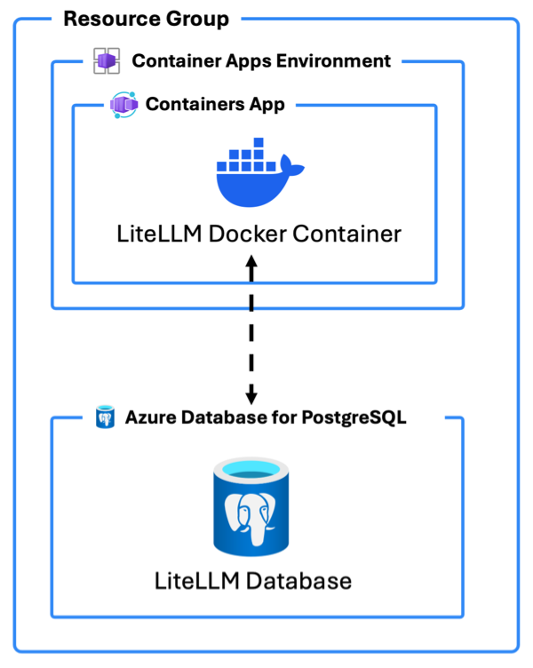

# azd-litellm 

An `azd` template to deploy [LiteLLM](https://www.litellm.ai/) running in Azure Container Apps using an Azure PostgreSQL database.

To use this template, follow these steps using the [Azure Developer CLI](https://learn.microsoft.com/azure/developer/azure-developer-cli/overview):

1. Log in to Azure Developer CLI. This is only required once per-install.

    ```bash
    azd auth login
    ```

2. Initialize this template using `azd init`:

    ```bash
    azd init --template build5nines/azd-litellm
    ```

3. Use `azd up` to provision your Azure infrastructure and deploy the web application to Azure.

    ```bash
    azd up
    ```

4. `azd up` will prompt you to enter these additional secret and password parameters used to configure LiteLLM:

    - `databaseAdminPassword`: The Admin password use to connect to the PostgreSQL database.
    - `litellm_master_key`: The LiteLLM Master Key. This is the LiteLLM proxy admin key.
    - `litellm_salt_key`: The LiteLLM Salt Key. This cannot be changed once set, and is used to encrypt model keys in the database.

    Be sure to save these secrets and passwords to keep them safe.

5. Once the template has finished provisioning all resources, and Azure Container Apps has completed deploying the LiteLLM container _(this can take a minute or so after `azd up` completes to finish)_, you can access both the Swagger UI and Admin UI for LiteLLM.

    This can be done by navigating to the `litellm` service **Endpoint** returned from the `azd` deployment step using your web browser. _You can also find this endpoint by navigating to the **Container App** within the **Azure Portal** then locating the **Application Url**._

    

    Navigating to the Endpoint URL will access Swagger UI:

    

    Navigating to `/ui` on the Endpoint URL will access the LiteLLM Admin UI where Models and other things can be configured:

    

## Architecture Diagram



In addition to deploying Azure Resources to host LiteLLM, this template includes a `DOCKERFILE` that builds a LiteLLM docker container that builds the LiteLLM proxy server with Admin UI using Python from the `litellm` pip package.

## Azure Resources

These are the Azure resources that are deployed with this template:

- **Container Apps Environment** - The environment for hosting the Container App
- **Container App** - The hosting for the [LiteLLM](https://www.litellm.ai) Docker Container
- **Azure Database for PostgreSQL flexible server** - The PostgreSQL server to host the LiteLLM database
- **Log Analytics** and **Application Insights** - Logging for the Container Apps Environment
- **Container Registry** - Used to deploy the custom Docker container for LiteLLM

## Author

This `azd` template was written by [Chris Pietschmann](https://pietschsoft.com), founder of [Build5Nines](https://build5nines.com), Microsoft MVP, HashiCorp Ambassador, and Microsoft Certified Trainer (MCT).
